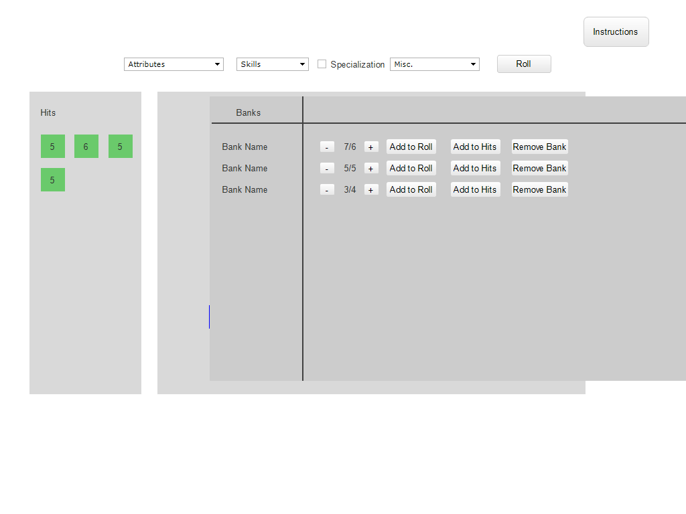
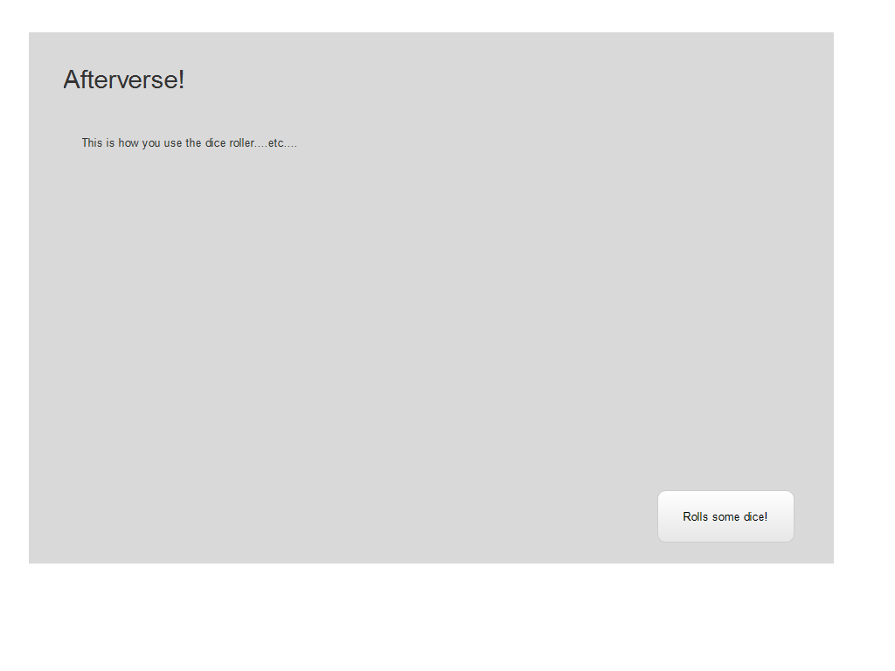

# Afterverse diceroller
a Dice roller for the tabletop RPG Afterverse

## [Afterverse](https://www.afterver.se/)

## Background
Afterverse is a futuristic Science Fiction Tabletop Rollplaying Game designed by Ray Nothnagel. The game uses six sided dice (d6s) to determine success or failure. A player roll a certain number of dice based on your attributes, skills, and other bonuses or penalties, and any 5s or 6s that come up are considered Hits. Total the number of Hits rolled, and compare that to a target number. If the result meets or exceeds the target number, the test is passed!

A unqiue feature of Afterverse is it's banking system, where roll results can be saved for later use. These "banked" Hits can be used to either add more dice to a new roll, or added to the result, depending on the test. Depending on the character's abilities, a player may add or subtract Hits to their bank before using it. A player can have multiple banks at one time.

## Functionality and MVPs
In this dice roller, users will be able to:
* Select their attributes, skills, and total bonuses and penalties to determine the number of dice they roll
* Roll their dice to determine their number of hits (Possibly adding an animation to the dice roll)
* Have the option to bank their result, naming the bank what they want
* Select banks they have already created
* Choose to add or subtract Hits to A bank before using it.
* Either spend the bank on more dice for a roll, or on more Hits after a roll.

Additionally, this project will have:
* A modal describing how to use the dice roller
* A production README

## Wireframes

The project will be one single screen, with two modals that will open on clicks. 
One modal will have instructions, and will open on loading the app, This can also be accessed by a button on the top right.
The other modal will have all banked rolls and can be access on the right sidebar.
The main screen will have a line of drop down menues, where you can select how many dice you get from your attributes, skills, and other miscellaneous sources, and a roll button. the main section will display the rolling dice animation, as well as highlight any 5s or 6s that come up. To the left will be a sidebar containing any Hits, displaying as a line of dice. 

## Technologies

This project will use the following technologies:
* Javascript for frontend rendering and dice logic, as well as a small backend for the Banks
* D3 for dice rolling animation
* CSS and HTML for browser side rendering and display

There will be two scripts used:
* `Dice.js` will handle the logic of randomly determining the dice result, as well as saving the result.
* `Roll.js` will determine roll animation.
* `Bank.js` will store banks to the state and backend, as well as handle using Banks in future rolls.

## Implementation Timeline:

**Day 1:** Create file structure and start learning D3 to implement rolling animation. Start on `Dice.js` and `Bank.js` files.

**Day 2:** Create display and CSS files, as well as start on rolling animation.

**Day 3:** Finish rolling animation, and start working on modals for instructions and banks

**Day 4:** Wrap up bank logic and implementation, and touch up any CSS or styling.

## Bonus Features

Add more advanced Afterverse design, such as individual class-specific banking rules.

